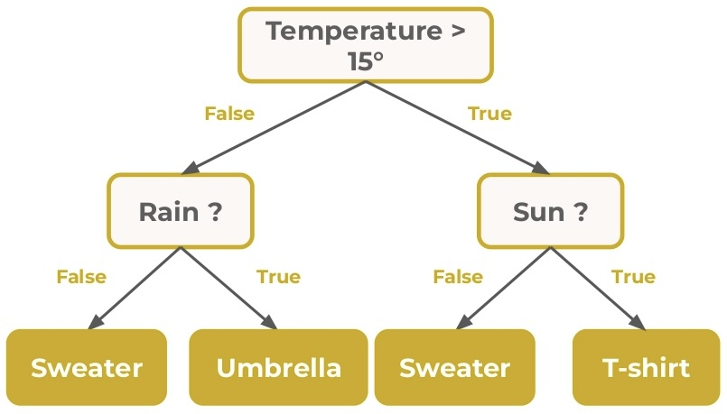
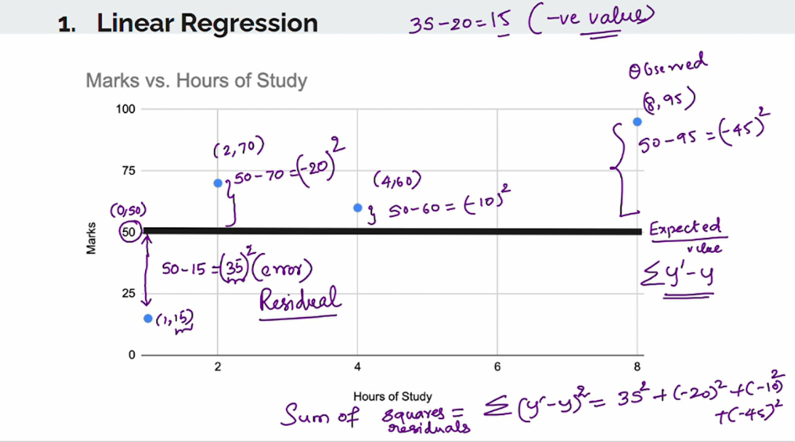
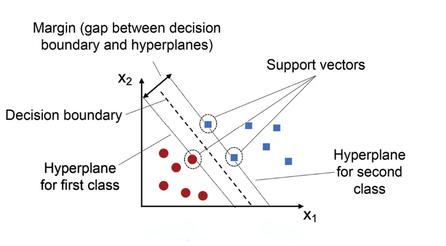

# AI Machine Learning

Contents
- [Overview & Index](#overview--index)
- [1) Machine Learning — Build an AI model (8 steps)](#1-machine-learning-steps)
- [Basic info](#basic-info)
- [2) Encodings (summary)](#2-encodings)
- [3) Feature engineering & selection](#3-feature-engineering--selection)
- [4) Algorithms (overview)](#4-algorithms-overview)
  - [Classification (logistic, trees, ensembles)](#classification)
  - [Regression (linear, others)](#regression)
- [5) Metrics (classification & regression)](#5-metrics)
- [6) Colab notebooks & resources](#6-colab-notebooks)
- [Diagrams / Images (placeholders)](#images)

---

Index (original-style)
|  SNo | Topic                  | Link                                                                    |
| ---: | ---------------------- | ----------------------------------------------------------------------- |
|    1 | Machine Learning Steps | [1) Machine Learning — Build an AI model](#1-machine-learning-steps)    |
|      | Basic Info             | [Basic info](#basic-info)                                               |
|    2 | Encodings              | [2) Encodings](#2-encodings)                                            |
|    3 | Feature Engineering    | [3) Feature engineering & selection](#3-feature-engineering--selection) |
|    4 | Algorithms             | [4) Algorithms (overview)](#4-algorithms-overview)                      |
|    5 | Metrics                | [5) Metrics](#5-metrics)                                                |
|    6 | Colab code             | [6) Colab notebooks & resources](#6-colab-notebooks)                    |
|    7 | Diagram                | [Images](#images)                                                       |

---

# 1) Machine Learning — Build an AI model (8 steps)

1. Acquire data
   - Collect dataset from CSV/Excel, database, API, scraping, public dataset.
   - Example: download 500 images each of apples, bananas, oranges.

2. Explore (EDA)
   - Inspect features (columns), sample counts (rows), missing values, distributions, class balance, outliers.
   - Tools: pandas.describe(), value_counts(), histograms, boxplots.

3. Clean & prepare
   - Remove duplicates, impute or drop missing values, fix types, parse dates, convert text to numeric (encodings), scale/normalize numeric features.
   - Example: convert color names to numeric codes, scale size/weight to [0,1].

4. Feature engineering / transform
   - Select useful features, create derived features, bin continuous values, encode categories appropriately, reduce dimensionality if needed (PCA, feature selection).
   - Link: see [Encodings](#2-encodings) and [Feature importance / VIF](#3-feature-engineering--selection).

5. Split data
   - Train / Validation / Test or Train + CV + Test. Common: 70/30 or 80/20, or train/val/test = 60/20/20.
   - Use stratified splits for classification when classes imbalanced.

6. Build & train the model
   - Choose algorithm by problem type (classification/regression). Fit on training data only.
   - Use pipelines to combine preprocessing + model.

7. Evaluate & fine-tune
   - Use validation set or cross-validation. Check appropriate metrics (see [Metrics](#5-metrics)).
   - Tune hyperparameters (grid/random search, Bayesian), try different models, use regularization.
   - Link: if using target encoding or other supervised transforms, be careful to avoid leakage (use CV folds).

8. Final test
   - Evaluate tuned model on unseen test set to report final performance. Save model, document preprocessing, and deploy.

---

# Basic info (quick)

- Feature = input (independent variable) = X
- Target = output (dependent variable) = y
- Multicollinearity = two or more independent variables highly correlated (problematic for linear models)

Bias (short)
- Bias = model's tendency to systematically under- or over-predict; high bias → underfitting.

---

# 2) Encodings (categorical → numeric) — summary and when to use

Encoding types and use cases:

- One-Hot Encoding
  - Use for nominal (unordered) categories with relatively few unique values. Expands columns.

- Label Encoding
  - Map categories to integers. Use for ordinal data or tree models when order meaningful.

- Ordinal Encoding
  - Use when categories have a defined order (e.g., Low < Medium < High).

- Frequency Encoding
  - Replace category by its frequency / count. Works well with tree-based models and high-cardinality features.

- Target / Mean Encoding
  - Replace category with the mean of the target. Powerful but must use cross-validation / smoothing to prevent leakage.

- Binary Encoding
  - Efficient alternative to one-hot for high-cardinality: encodes categories to binary digits and expands to a few columns.

- Hash Encoding
  - Fixed-length hashed representation. Good for very high-cardinality text features; beware collisions.

- Weight of Evidence (WoE) Encoding
  - Use in credit scoring / finance for binary target. Converts category to log-odds; interpretability for risk models.

Quick decision guide
- Nominal (few categories) → One-Hot
- Ordinal → Ordinal / Label
- Many categories → Binary / Frequency / Hash / Target (with folds)

See Colab encodings in [Colab notebooks](#6-colab-notebooks).

---

# 3) Feature engineering & selection

Feature importance — short
- Purpose: identify features that contribute most to predictions. Remove irrelevant ones to speed training and reduce overfitting.
- Methods:
  - Model-based: RandomForest.feature_importances_, XGBoost gain, coefficients in linear models.
  - Permutation importance: shuffle a single feature and measure drop in performance (reports mean and std).
  - SHAP / LIME for local and global explainability.

Permutation importance interpretation
- importance_mean: higher → feature important
- importance_std: lower → stable estimate

Variance Inflation Factor (VIF) — detect multicollinearity
- Definition: VIF measures how much the variance of a coefficient is increased because of collinearity.
- Formula: VIF = 1 / (1 - R²) where R² is from regressing the feature on all other features.
- How to compute:
  1. For each independent feature Xi, regress Xi ~ other features.
  2. Compute R²_i.
  3. VIF_i = 1 / (1 - R²_i).
- Rule of thumb:
  - VIF ≈ 1: no multicollinearity
  - 1–5: moderate
  - >5: high → investigate
  - >10: serious → consider dropping or combining features
- Use-case:
  - Use VIF for linear models (Linear Regression, Logistic Regression, LDA). Not necessary for tree-based models.

Practical steps
- Start with feature importance to drop irrelevant features.
- Check VIF for remaining numeric features if using linear models.
- Re-evaluate model performance after dropping correlated features.

Links:
- See examples for feature importance, VIF, interpretation in [Colab notebooks](#6-colab-notebooks).

---

# 4) Algorithms (overview)

Learning types
- Supervised: classification, regression
- Unsupervised: clustering, dimensionality reduction
- Semi-supervised
- Reinforcement learning

## Classification (predict discrete class)

Common algorithms:
- Logistic Regression (binary / multinomial / ordinal)
- Decision Tree
- Random Forest
- Support Vector Machines (SVM)
- k-NN
- Gradient Boosting (XGBoost, LightGBM, CatBoost)
- Neural Networks

Logistic Regression (concise)
- Binary: uses sigmoid function to map linear combo of inputs to probability in (0,1).
  - Sigmoid: p = 1 / (1 + e^{-z}), where z = w·x + b.
  - Decide class by threshold (commonly 0.5), but threshold can be tuned.
- Multinomial: use softmax for K classes:
  - For class k: p_k = exp(z_k) / sum_j exp(z_j)
- Ordinal logistic: for ordered categories; uses cumulative logits and learned thresholds.

Multinomial example (short)
- Suppose classes Apple(0), Banana(1), Orange(2). Compute z_k = β0_k + β1_k·weight + β2_k·color. Apply softmax to get probabilities; choose class with highest p_k.

Decision Tree (short)
- Splits data by feature thresholds to create a tree. Interpretability is strong but trees can overfit.
- Key hyperparameter: max_depth — control complexity. Smaller depth → simpler model; large depth → may overfit.

Random Forest (short)
- Ensemble of decision trees trained on bootstrapped samples and random feature subsets. Improves stability and accuracy versus single tree.
- Important hyperparameters: n_estimators, max_depth, max_features, min_samples_split.

## Regression (predict continuous value)

Common algorithms:
- Linear Regression (simple / multiple)
- Ridge, Lasso, Elastic Net (regularized linear models)
- Polynomial Regression
- Support Vector Regression (SVR)
- Tree-based regressors, Random Forest Regressor, Gradient Boosting Regressor
- Time-series specific models (ARIMA, Prophet)

Linear Regression (concise)
- Model: y = b0 + b1·x1 + b2·x2 + ... + bn·xn
- Fit coefficients by minimizing MSE (ordinary least squares).
- Check assumptions (linearity, homoscedasticity, independence, normal residuals) when interpreting coefficients.

When to choose regression vs classification
- Regression when target is continuous (e.g., price, temperature).
- Classification when target is categorical (labels).

---

# 5) Metrics (classification & regression)

Classification metrics
- Confusion matrix: TP, FP, TN, FN (use to compute other metrics)
- Accuracy = (TP + TN) / total
- Precision = TP / (TP + FP) — of predicted positives, how many are correct
- Recall (Sensitivity) = TP / (TP + FN) — of actual positives, how many detected
- F1-score = 2 * (precision * recall) / (precision + recall) — harmonic mean, good for imbalance
- ROC AUC: area under ROC curve for ranking performance

Regression metrics
- MSE (Mean Squared Error): average squared difference between actual and predicted
- RMSE: sqrt(MSE) — same units as target
- MAE (Mean Absolute Error): average absolute difference
- R² (coefficient of determination): proportion of variance explained by model (closer to 1 is better)

Choose metrics according to business need and class balance. For imbalanced classification, prefer precision/recall/F1 or PR-AUC over accuracy.

(Placeholders for confusion matrix / metric diagrams are under [Images](#images).)

---

# 6) Colab notebooks & quick links

- Linear & Random Forest: https://colab.research.google.com/drive/1-LYZCAFAdM5NUpJxW71IVBl3UoLf5pke
- Classification metrics: https://colab.research.google.com/drive/1s4fQIOxukwezE7KzoZFIvTqTnpBlZ6N_
- Regression metrics, Feature Importance & VIF: https://colab.research.google.com/drive/1Txgcd2DmsjPXJ8x5nD4LMdSj9uxa-dm_
- Encoding (OneHot): https://colab.research.google.com/drive/16wYJdwDJJJuuGtUMszE-HAcKHPwKYVWl
- Encoding (Label & Ordinal): https://colab.research.google.com/drive/1UU4tdSoXSBA2l5zjajfVtV5kS6tc-pkq
- Encoding (Frequency & Target): https://colab.research.google.com/drive/1KKmWEop8VwiMjtxWwuqOYfupSwH4eYLa
- Encoding (Binary & Hash): https://colab.research.google.com/drive/1nYOvCHMp9f66KXAcLlljwEaBO-Kab_Lx

---

# Diagrams / Images (placeholders)

- Permutation importance:  *(Placeholder - diagram showing feature importance rankings)*
- VIF formula / illustration:  *(Placeholder - VIF calculation and interpretation guide)*
- Decision tree diagram: 
- Random forest diagram:  *(Placeholder - ensemble learning visualization)*
- Confusion matrix & metric images:  *(Placeholder - classification metrics visualization)*
- Linear classifier example: 
- SVM classification: 

(Replace these placeholders with your actual images or links. If you provide the image files I can insert exact names/paths.)

---

Notes & cross-links
- From any model-building step, refer to [Encodings](#2-encodings) when preparing categorical data.
- When selecting features, use [Feature engineering & selection](#3-feature-engineering--selection) and the [Colab notebook for VIF & importance](#6-colab-notebooks).
- Model evaluation refers to [Metrics](#5-metrics) and the classification/regression notebooks.

---