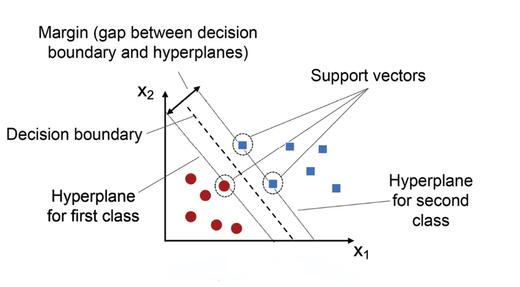

## **Fundamentals**
---
- **Math**
	1. [Linear Algebra](Fundamentals%20-%20Math/Linear%20Algebra%20(vectors,%20matrices,%20eigenvalues).md)
	2. [Probability and Statistics](Fundamentals%20-%20Math/Probability%20and%20Statistics.md)
	3. [Calculus (derivatives, gradients)](Fundamentals%20-%20Math/Calculus%20(derivatives,%20gradients).md)
	4. [Optimization (gradient descent)](Fundamentals%20-%20Math/Optimization%20(gradient%20descent).md)

- **Program**
	Language: **Python**
	Setup:
	- Install Python: [python.org](https://www.python.org/downloads/)
	- Jupyter Notebook: pip install **notebook** or use **Anaconda**
	- Basic Libraries: `pip install numpy pandas matplotlib seaborn`
	Key Libraries:
	1. `numpy`, `pandas` (Data handling)
	2. `matplotlib`, `seaborn` (Visualization)

## **Data Handling**
---
- **[Wrangling](Data%20Handling/Wrangling.md)**
	1. Cleaning
	2. Normalization
	3. Train/Test Split
- **[EDA (Exploratory Data Analysis)](Data%20Handling/EDA%20(Exploratory%20Data%20Analysis).md)**
	1. Correlations
	2. Distributions
	3. Feature Insights
## **Machine Learning**
---
- **Supervised**
	1. [[Linear Regression]]
	
	2. Logistic Regression
	3. Decision Trees
	
	4. Support Vector Machines
	
	5. Random Forest
- **Unsupervised**
	1. K-Means
	2. PCA
- **Evaluation**
	1. Cross-validation
	2. Hyperparameter Tuning
	3. Avoid Overfitting

## **Deep Learning**
---
- **Basics**
	1. Perceptron's
	2. Activation
	3. Backprop
	4. Optimizers
- **Frameworks**
	1. PyTorch
	2. TensorFlow/Keras
- **Architectures**
	1. CNN
	2. RNN/LSTM
	3. Transformers
## **Projects & Deployment**
---
- **Projects**
	1. Predictive Models
	2. Image Classification
	3. Sentiment Analysis
	4. Recommenders
- **Deployment**
	Save models, REST API (Flask/FastAPI), Streamlit, Docker

## **Advanced Topics**
---
- NLP
- Computer Vision
- Reinforcement Learning
- Generative AI

**Tools & Best Practices**
- **Tools**: Git/GitHub, MLflow/W&B, Cloud (Colab, AWS, GCP)
- **Best Practices** → Data validation, Reproducibility, Ethical AI

